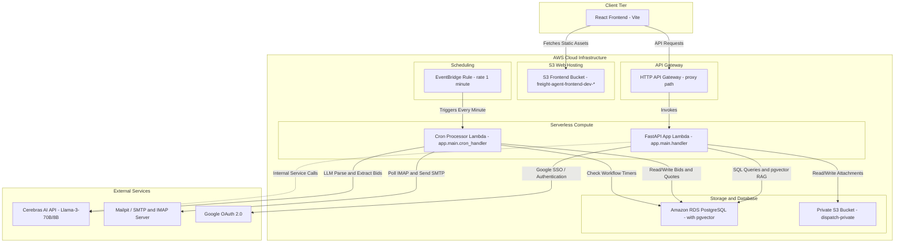
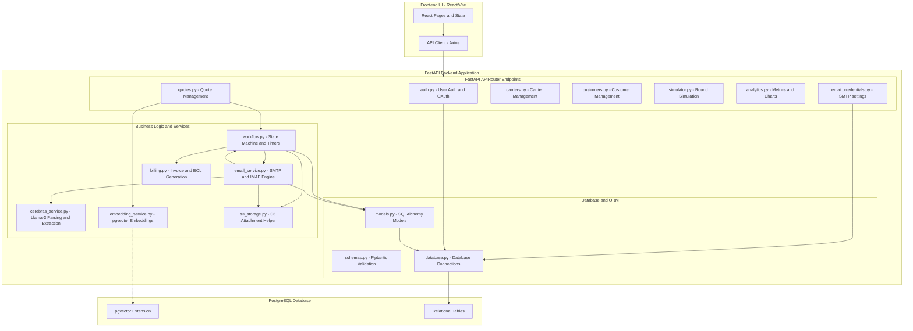

# Freight Bidding Workflow Orchestrator (AWS Lambda + S3)

An automated competitive freight bidding API running on AWS Lambda and API Gateway using Python, FastAPI, and Mangum. This application stores and retrieves bidding metadata and quotes as JSON documents in Amazon S3.

## Architecture Diagrams

### 1. AWS Architecture Diagram



### 2. Application Architecture Diagram



---


## Prerequisites

Before starting, ensure you have the following installed on your machine:
* **Node.js** (v18 or higher) & **npm**
* **Python 3.11**
* **AWS Account** and access keys with permissions to manage resources

---

## Project Structure

* `/app`
    * [main.py](file:///Users/sandeepkumar/github/freight-agent-aws/app/main.py): FastAPI app configuration, endpoint routes, and the Mangum adapter.
    * [s3_storage.py](file:///Users/sandeepkumar/github/freight-agent-aws/app/s3_storage.py): CRUD helper for managing S3 JSON documents.
* `/docs`
    * [openapi.json](file:///Users/sandeepkumar/github/freight-agent-aws/docs/openapi.json): OpenAPI v3.1.0 specification.
    * [deployment_policy.json](file:///Users/sandeepkumar/github/freight-agent-aws/docs/deployment_policy.json): IAM policy required for the deployer user (`dispatch`).
    * [execution_policy.json](file:///Users/sandeepkumar/github/freight-agent-aws/docs/execution_policy.json): IAM policy required for the Lambda execution role.
    * [execution_trust_policy.json](file:///Users/sandeepkumar/github/freight-agent-aws/docs/execution_trust_policy.json): Trust relationship configuration for the Lambda execution role.
* [serverless.yml](file:///Users/sandeepkumar/github/freight-agent-aws/serverless.yml): Serverless Framework configuration.

---

## Local Setup

### 1. Configure Credentials
Create a `.env` file in the root directory (make sure this is not committed to git):
```ini
ACCESS_KEY=your_aws_access_key
SECRET_ACCESS_KEY=your_aws_secret_access_key
S3_BUCKET_NAME=dispatch-private
```

### 2. Install Dependencies
Install Node.js dependencies for the Serverless Framework and its plugins:
```bash
npm install
```

Set up the Python virtual environment and install dependencies:
```bash
python3 -m venv venv
source venv/bin/activate
pip install -r requirements.txt
```

---

## AWS Setup & Policies

To deploy and run this application, two sets of policies must be configured in your AWS account.

### 1. Deployment User (`dispatch` IAM User)
The user deploying the project needs permissions to create CloudFormation stacks, S3 buckets, IAM roles, Lambda functions, API Gateway instances, and CloudWatch Log Groups.
* Attach the policy found in [docs/deployment_policy.json](file:///Users/sandeepkumar/github/freight-agent-aws/docs/deployment_policy.json) directly to the **`dispatch`** IAM user.

### 2. Lambda Execution Role
The runtime Lambda function itself needs to be allowed to interact with S3 and CloudWatch Logs. 
* This role is automatically provisioned and managed by the Serverless Framework during deployment based on the `iam.role.statements` definition in `serverless.yml`. 
* The corresponding policy definitions are located in [docs/execution_policy.json](file:///Users/sandeepkumar/github/freight-agent-aws/docs/execution_policy.json) and [docs/execution_trust_policy.json](file:///Users/sandeepkumar/github/freight-agent-aws/docs/execution_trust_policy.json) for reference.

---

## Running Locally

### 1. Run the FastAPI server:
```bash
source venv/bin/activate
uvicorn app.main:app --reload
```
Once running, view the interactive API documentation at:
* Swagger UI: [http://127.0.0.1:8000/docs](http://127.0.0.1:8000/docs)
* Redoc: [http://127.0.0.1:8000/redoc](http://127.0.0.1:8000/redoc)

### 2. Run the React frontend:
```bash
cd frontend
npm install --legacy-peer-deps
npm run dev
```
Open [http://localhost:5173](http://localhost:5173) in your browser.

---

## Deployment

### 1. Deploy the API to AWS Lambda:
```bash
npx serverless deploy
```
*Note: This project uses **Serverless Framework v3** to allow deployments locally without requiring a login or paid subscription.*

### 2. Deploy the Frontend to S3:
To build and deploy the frontend static website to S3, run:
```bash
./deploy_frontend.sh [stage]
```
For example, to deploy to the default `dev` stage:
```bash
./deploy_frontend.sh dev
```
This script will:
1. Retrieve your AWS Account ID to resolve the bucket name (`freight-agent-frontend-<stage>-<account_id>`).
2. Install frontend dependencies.
3. Build the frontend static files using Vite, injecting the backend `API_URL` dynamically.
4. Upload/sync the built files to the S3 bucket.
5. Print the public HTTP URL of your deployed frontend.

### Clean Up (Teardown)
To remove the deployed stack and delete the associated AWS resources (excluding the persistent S3 data bucket):
```bash
npx serverless remove
```
*If a deployment fails on the first run, the stack may get stuck in a `DELETE_FAILED` state. You can resolve this by force-deleting the stack from the AWS CloudFormation Management Console.*

---

## Running Integration Tests

We have included an integration test suite to verify the live API Gateway, Lambda, S3, and DynamoDB integrations.

To run the integration tests:
1. Ensure your `.env` contains the correct `API_URL` variable:
   ```ini
   API_URL=https://<api-id>.execute-api.<region>.amazonaws.com
   ```
2. Activate your virtual environment and run the test script:
   ```bash
   source venv/bin/activate
   python test_api.py
   ```

The script will automatically perform root healthchecks, create a quote, retrieve the quote by ID, list all quotes, and request a pre-signed S3 upload URL.

